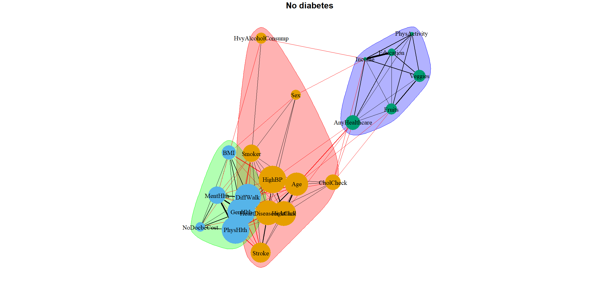
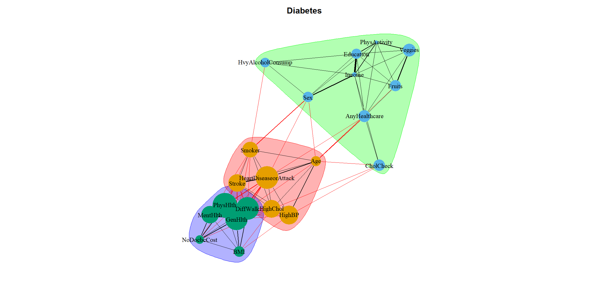

MEDI 504B Assignment 1
================
Kira Tosesky, Irvin Ng, Johnathan Wong
2024-01-12

``` r
DiabetesHIDataSet_train <-
  read_csv(
    "~/DiabetesHIDataSet_train.csv",
    col_types = cols(
      AnyHealthcare = col_factor(levels = c("0", "1")),
      CholCheck = col_factor(levels = c("0", "1")),
      Diabetes_binary = col_factor(levels = c("0", "1")),
      DiffWalk = col_factor(levels = c("0", "1")),
      Fruits = col_factor(levels = c("0", "1")),
      HeartDiseaseorAttack = col_factor(levels = c("0", "1")),
      HighBP = col_factor(levels = c("0", "1")),
      HighChol = col_factor(levels = c("0", "1")),
      HvyAlcoholConsump = col_factor(levels = c("0", "1")),
      NoDocbcCost = col_factor(levels = c("0", "1")),
      PhysActivity = col_factor(levels = c("0", "1")),
      Sex = col_factor(levels = c("0", "1")),
      Smoker = col_factor(levels = c("0", "1")),
      Stroke = col_factor(levels = c("0", "1")),
      Veggies = col_factor(levels = c("0", "1"))
    )
  )
saveRDS(DiabetesHIDataSet_train, file = "DiabetesHIDataSet_train.RDS")
```

``` r
DiabetesHIDataSet_train <-  readRDS("DiabetesHIDataSet_train.RDS")
DiabetesHIDataSet_train <- DiabetesHIDataSet_train %>%
  mutate(Diabetes_binary = recode_factor(Diabetes_binary, `0` = "No diabetes", `1` = "Diabetes"))
str(DiabetesHIDataSet_train, give.attr = FALSE)
```

    ## tibble [49,564 x 22] (S3: tbl_df/tbl/data.frame)
    ##  $ Diabetes_binary     : Factor w/ 2 levels "No diabetes",..: 1 1 1 1 1 1 1 1 1 1 ...
    ##  $ HighBP              : Factor w/ 2 levels "0","1": 1 1 1 1 2 1 2 1 1 1 ...
    ##  $ HighChol            : Factor w/ 2 levels "0","1": 1 1 2 1 2 1 1 2 1 1 ...
    ##  $ CholCheck           : Factor w/ 2 levels "0","1": 2 2 2 2 2 2 2 2 2 2 ...
    ##  $ BMI                 : num [1:49564] 29 18 26 31 24 21 58 29 18 30 ...
    ##  $ Smoker              : Factor w/ 2 levels "0","1": 2 1 2 2 2 1 1 2 2 1 ...
    ##  $ Stroke              : Factor w/ 2 levels "0","1": 1 1 1 1 1 1 1 1 1 1 ...
    ##  $ HeartDiseaseorAttack: Factor w/ 2 levels "0","1": 1 1 1 1 2 1 1 1 1 1 ...
    ##  $ PhysActivity        : Factor w/ 2 levels "0","1": 2 2 2 1 2 2 1 2 2 2 ...
    ##  $ Fruits              : Factor w/ 2 levels "0","1": 2 2 2 2 2 2 2 2 2 1 ...
    ##  $ Veggies             : Factor w/ 2 levels "0","1": 2 2 2 2 2 2 2 1 1 2 ...
    ##  $ HvyAlcoholConsump   : Factor w/ 2 levels "0","1": 1 1 2 1 1 1 1 1 1 1 ...
    ##  $ AnyHealthcare       : Factor w/ 2 levels "0","1": 2 1 2 2 2 2 2 2 2 2 ...
    ##  $ NoDocbcCost         : Factor w/ 2 levels "0","1": 1 1 1 1 1 1 1 1 1 1 ...
    ##  $ GenHlth             : num [1:49564] 2 2 1 4 3 1 3 1 3 2 ...
    ##  $ MentHlth            : num [1:49564] 0 7 0 0 0 0 3 0 0 0 ...
    ##  $ PhysHlth            : num [1:49564] 0 0 0 0 4 0 3 0 0 0 ...
    ##  $ DiffWalk            : Factor w/ 2 levels "0","1": 1 1 1 1 1 1 1 2 1 1 ...
    ##  $ Sex                 : Factor w/ 2 levels "0","1": 1 1 2 2 1 2 2 1 1 1 ...
    ##  $ Age                 : num [1:49564] 8 1 13 6 12 4 10 10 10 9 ...
    ##  $ Education           : num [1:49564] 5 4 5 4 4 6 4 5 4 5 ...
    ##  $ Income              : num [1:49564] 8 7 6 3 6 8 6 1 6 7 ...

``` r
# Exploratory Data Analysis----
summary(DiabetesHIDataSet_train)  # Basic 
```

    ##     Diabetes_binary  HighBP    HighChol  CholCheck      BMI        Smoker   
    ##  No diabetes:24869   0:21703   0:23524   0: 1218   Min.   :12.00   0:26004  
    ##  Diabetes   :24695   1:27861   1:26040   1:48346   1st Qu.:25.00   1:23560  
    ##                                                    Median :29.00            
    ##                                                    Mean   :29.86            
    ##                                                    3rd Qu.:33.00            
    ##                                                    Max.   :98.00            
    ##  Stroke    HeartDiseaseorAttack PhysActivity Fruits    Veggies  
    ##  0:46517   0:42214              0:14657      0:19181   0:10480  
    ##  1: 3047   1: 7350              1:34907      1:30383   1:39084  
    ##                                                                 
    ##                                                                 
    ##                                                                 
    ##                                                                 
    ##  HvyAlcoholConsump AnyHealthcare NoDocbcCost    GenHlth         MentHlth     
    ##  0:47455           0: 2210       0:44934     Min.   :1.000   Min.   : 0.000  
    ##  1: 2109           1:47354       1: 4630     1st Qu.:2.000   1st Qu.: 0.000  
    ##                                              Median :3.000   Median : 0.000  
    ##                                              Mean   :2.836   Mean   : 3.742  
    ##                                              3rd Qu.:4.000   3rd Qu.: 2.000  
    ##                                              Max.   :5.000   Max.   :30.000  
    ##     PhysHlth      DiffWalk  Sex            Age           Education    
    ##  Min.   : 0.000   0:37000   0:26886   Min.   : 1.000   Min.   :1.000  
    ##  1st Qu.: 0.000   1:12564   1:22678   1st Qu.: 7.000   1st Qu.:4.000  
    ##  Median : 0.000                       Median : 9.000   Median :5.000  
    ##  Mean   : 5.832                       Mean   : 8.582   Mean   :4.921  
    ##  3rd Qu.: 5.000                       3rd Qu.:11.000   3rd Qu.:6.000  
    ##  Max.   :30.000                       Max.   :13.000   Max.   :6.000  
    ##      Income     
    ##  Min.   :1.000  
    ##  1st Qu.:4.000  
    ##  Median :6.000  
    ##  Mean   :5.703  
    ##  3rd Qu.:8.000  
    ##  Max.   :8.000

> Our dataset contains 49,564 and 22 features. Of the 22 features, 15
> are categorical, all of which are binary. The remaining 7 features are
> binary.

``` r
# Define the ranges for each of the integer variables
income_categories <- range(DiabetesHIDataSet_train$Income)
genhlth_categories <- range(DiabetesHIDataSet_train$GenHlth)
menthlth_categories <- range(DiabetesHIDataSet_train$MentHlth)
physlth_categories <- range(DiabetesHIDataSet_train$PhysHlth)
age_categories <- range(DiabetesHIDataSet_train$Age)
education_categories <- range(DiabetesHIDataSet_train$Education)
bmi_possible_values <- range(DiabetesHIDataSet_train$BMI)

# Number of binary variables
num_binary_variables <- DiabetesHIDataSet_train %>%
  select_if(is.factor) %>%
  ncol()

# Calculate the probability for binary variables
prob_binary <- (1 / 2) ^ num_binary_variables

# Calculate the probability for integer variables
prob_integer <-
  (1 / income_categories) * (1 / genhlth_categories) * (1 / menthlth_categories) *
  (1 / physlth_categories) * (1 / age_categories) * (1 / education_categories) *
  (1 / bmi_possible_values)

# Final probability of two individuals having identical records
probability_identical <- prob_binary * prob_integer
probability_identical
```

    ## [1]          Inf 1.108988e-13

``` r
num_records <- nrow(DiabetesHIDataSet_train)
#calculate probability of any instance of a "real" duplicate in dataset (i.e. two unique individuals with matching values across all columns)
probability_identical * num_records
```

    ## [1]          Inf 5.496589e-09

> Based on these probablities, it is unlikely that any identical records
> are from unique individuals, so we can remove duplicates safely.

``` r
# Does each row repesent a unique patient record?
# Find duplicated rows based on all columns
duplicated_rows <-
  DiabetesHIDataSet_train[duplicated(DiabetesHIDataSet_train), ]

# View the duplicated rows
print(duplicated_rows)
```

    ## # A tibble: 905 x 22
    ##    Diabetes_binary HighBP HighChol CholCheck   BMI Smoker Stroke
    ##    <fct>           <fct>  <fct>    <fct>     <dbl> <fct>  <fct> 
    ##  1 No diabetes     0      0        1            22 0      0     
    ##  2 No diabetes     0      0        1            21 0      0     
    ##  3 No diabetes     0      0        1            28 0      0     
    ##  4 No diabetes     0      0        1            27 0      0     
    ##  5 No diabetes     0      0        1            22 0      0     
    ##  6 No diabetes     0      0        1            25 0      0     
    ##  7 No diabetes     0      0        1            25 0      0     
    ##  8 No diabetes     0      0        1            25 0      0     
    ##  9 No diabetes     0      0        1            23 0      0     
    ## 10 No diabetes     0      0        1            25 0      0     
    ## # i 895 more rows
    ## # i 15 more variables: HeartDiseaseorAttack <fct>, PhysActivity <fct>,
    ## #   Fruits <fct>, Veggies <fct>, HvyAlcoholConsump <fct>, AnyHealthcare <fct>,
    ## #   NoDocbcCost <fct>, GenHlth <dbl>, MentHlth <dbl>, PhysHlth <dbl>,
    ## #   DiffWalk <fct>, Sex <fct>, Age <dbl>, Education <dbl>, Income <dbl>

``` r
# Calculate number of duplicated rows
print(nrow(duplicated_rows))
```

    ## [1] 905

``` r
# Keep only unique rows in the dataframe
DiabetesHIDataSet_train_unique <- unique(DiabetesHIDataSet_train)
```

> There are 905 duplicated rows in our dataset.

``` r
# Automated EDA
create_report(DiabetesHIDataSet_train_unique, output_format = "pdf_document", output_file = "report.pdf")
```

> Based on the automated EDA, our dataset is not missing any
> observations. This is consistent with the metadata. The description of
> *MentlHlth* and *PhysHlth* in the metadata, however, did not match
> what we see in the histogram analysis. These two columns indicate the
> number of days the patient did not feel mentally or physically well in
> the last 30 days using a scale of 1-30. The data, however, shows that
> 0 is a possible value. Given that it is possible to not feel unwell in
> the last 30 days, we are inclined to believe the metadata is
> incorrect.

> Based on the histograms generated, we also found some outliers in the
> `BMI` features. There are some observations in the 60+ range with a
> max BMI of 98. We believe these outliers are biological, thus we do
> not remove them.

> In the correlation analysis, we see that *MentlHlth*, *PhysHlth*,
> *GenHlth* and *BMI* are clustered and positively correlated with each
> other. This is expected as these features can influence one and
> another, according to literature (need to find a citation).
> Furthermore, we observe a positive correlation between the features
> `DiffWalk` and `Diabetes_binary` and these features, indicating that
> difficulty in walking and having diabetes are correlated with these
> factors.

> Finally in the principal component analysis, we see that PC1 only
> accounted for 15.9% of the variance, showing that no single principal
> component explained a high variance in the data.

``` r
diabetes_pred <-
  DiabetesHIDataSet_train_unique %>% select(-Diabetes_binary)
  diabetes_class <- DiabetesHIDataSet_train_unique$Diabetes_binary
  
  
  # Exploratory Data Analysis
  ggplot(DiabetesHIDataSet_train_unique,
  aes(x = Diabetes_binary, fill = Diabetes_binary)) + geom_bar() + theme_bw()
```

<!-- -->

> Our dataset is fairly balanced.

``` r
# Define a smaller size for the mean points
mean_point_size <- 3

# Define color palette
colors <-
  brewer.pal(length(unique(stack(diabetes_pred)$ind)), "Set3")
```

    ## Warning in stack.data.frame(diabetes_pred): non-vector columns will be ignored

``` r
int_feat_violin_plot <-
  ggplot(stack(diabetes_pred), aes(x = ind, y = values, fill = ind)) +
  geom_violin() +
  ylab("Values") +
  xlab("Integer Features") +
  labs(fill = "Integer Features") +
  stat_summary(fun = mean, geom = "point") +
  theme_bw()
```

    ## Warning in stack.data.frame(diabetes_pred): non-vector columns will be ignored

``` r
# Display the plot
int_feat_violin_plot
```

<!-- -->

``` r
# Select only integer columns, excluding 'Diabetes_binary' for reshaping
integer_cols <- sapply(DiabetesHIDataSet_train_unique, is.integer) & names(DiabetesHIDataSet_train_unique) != "Diabetes_binary"

#DiabetesHIDataSet_train_unique %>%
#  select(which(integer_cols), Diabetes_binary) %>%
#  pivot_longer(cols = -Diabetes_binary, names_to = "variable", values_to = "value") %>%
#  ggplot(aes(x = value, fill = Diabetes_binary, color = Diabetes_binary)) +
#  geom_density(alpha = 0.3) +
#  facet_wrap(~ variable, scales = "free") +
#  theme_bw()


# Assuming 'diabetes_data2' is your dataframe

# Identify integer columns, excluding 'Diabetes_binary'
integer_cols <- sapply(DiabetesHIDataSet_train_unique, is.integer) & names(DiabetesHIDataSet_train_unique) != "Diabetes_binary"

# Reshape the data
long_data <- DiabetesHIDataSet_train_unique %>%
  select(which(integer_cols), Diabetes_binary) %>%
  pivot_longer(cols = -Diabetes_binary, names_to = "variable", values_to = "value")

# Subset for BMI (if BMI is an integer and part of the data)
bmi_data <- long_data %>% filter(variable == "BMI")

# Subset for other variables
other_data <- long_data %>% filter(variable != "BMI")

# Create density plot for BMI
density_plot <- ggplot(bmi_data, aes(x = value, fill = Diabetes_binary, color = Diabetes_binary)) +
  geom_density(alpha = 0.3) +
  labs(x = "BMI", y = "Density") +
  theme_minimal()

# Create bar plots for other variables
bar_plots <- ggplot(other_data, aes(x = value, fill = Diabetes_binary)) +
  geom_bar(position = "stack") +
  facet_wrap(~ variable, scales = "free") +
  labs( x = "Value", y = "Count") +
  theme_minimal()

# Arrange the plots
grid.arrange(density_plot, bar_plots, ncol = 1)
```

``` r
gather(DiabetesHIDataSet_train_unique, x, y, DiabetesHIDataSet_train_unique:Income) %>%  # selecting data pairs
  ggplot(aes(x = y, color = Diabetes_binary, fill = Diabetes_binary)) +
  geom_density(alpha = 0.3) +
  facet_wrap( ~ x, scales = "free", ncol = 3)
```

``` r
# Create correlation matrices
# Benign
co_mat_nodiabetes <-
  filter(DiabetesHIDataSet_train_unique,
         Diabetes_binary == "No diabetes") %>%
  select(-Diabetes_binary) %>%
  sapply(function(x)
    as.numeric(as.character(x))) %>%
  cor()
# Malignant
co_mat_diabetes <-
  filter(DiabetesHIDataSet_train_unique, Diabetes_binary == "Diabetes") %>%
  select(-Diabetes_binary) %>%
  sapply(function(x)
    as.numeric(as.character(x))) %>%
  cor()


g_nodiabetes <-
  graph.adjacency(
    co_mat_nodiabetes,
    weighted = TRUE,
    mode = "upper",
    diag = FALSE
  )
g_diabetes <-
  graph.adjacency(co_mat_diabetes,
                  weighted = TRUE,
                  mode = "upper",
                  diag = FALSE)

cut.off_nd <- mean(E(g_nodiabetes)$weight, na.rm = TRUE)
cut.off_d <- mean(E(g_diabetes)$weight)


g_nodiabetes_2 <-
  delete_edges(g_nodiabetes, which(E(g_nodiabetes)$weight < cut.off_nd))
g_diabetes_2 <-
  delete_edges(g_diabetes, which(E(g_diabetes)$weight < cut.off_d))


c_g_nodiabetes_2 <-
  cluster_fast_greedy(g_nodiabetes_2) # implements network clustering methods
c_g_diabetes_2 <- cluster_fast_greedy(g_diabetes_2)

par(mar = c(5, 5, 2, 2), cex.main = 2)
plot(
  c_g_nodiabetes_2,
  g_nodiabetes_2,
  vertex.size = colSums(co_mat_nodiabetes) * 10,
  # the larger the vertex/node the more correlated that vertex is with other features
  vertex.frame.color = NA,
  vertex.label.color = "black",
  vertex.label.cex = 1.5,
  edge.width = E(g_nodiabetes_2)$weight * 15,
  layout = layout_with_fr(g_nodiabetes_2),
  main = "No diabetes"
)
```

<!-- -->

``` r
par(cex.main = 2)
plot(
  c_g_diabetes_2,
  g_diabetes_2,
  vertex.size = colSums(co_mat_diabetes) * 10,
  # the larger the vertex/node the more correlated that vertex is with other features
  vertex.frame.color = NA,
  vertex.label.color = "black",
  vertex.label.cex = 1.5,
  edge.width = E(g_diabetes_2)$weight * 15,
  layout = layout_with_fr(g_diabetes_2),
  main = "Diabetes"
)
```

<!-- -->

> For both groups, the features were clustered into three groups. We can
> also see that the clusters were fairly similar to each other. The
> width of the edges in these plots indicate the weight which correspond
> to the strength of the correlation between the nodes. We observe that
> life style choices like eating vegetables and fruits correlate
> strongly with each other. Education and income also correlate strongly
> with each other. The size of each node is based on the sum of the
> correlation of that feature and we observe that features directly
> related to health have the highest sum.

``` r
# Principal Component Analysis

DiabetesHIDataSet_train_unique_num <-
  sapply(DiabetesHIDataSet_train_unique, as.numeric) %>% as.data.frame()
# perform pca and extract scores
pcaOutput <-
  prcomp(as.matrix(
    select(DiabetesHIDataSet_train_unique_num,-Diabetes_binary)
  ), scale = TRUE, center = TRUE)
pcaOutput2 <- as.data.frame(pcaOutput$x)
PoV <- pcaOutput$sdev ^ 2 / sum(pcaOutput$sdev ^ 2)
PoV
```

    ##  [1] 0.16987981 0.08287228 0.06350751 0.05735123 0.05666589 0.05130769
    ##  [7] 0.04918661 0.04493691 0.04423877 0.04182628 0.03911691 0.03785639
    ## [13] 0.03566164 0.03504159 0.03381994 0.03358125 0.03100798 0.02613078
    ## [19] 0.02416475 0.02290134 0.01894447

> Here we can once again see that no PCA component explained more 16.9%
> of the variance in the data.

``` r
# define groups for plotting
pcaOutput2$groups <-
  as.factor(DiabetesHIDataSet_train_unique_num$Diabetes_binary)

centroids <- aggregate(cbind(PC1, PC2) ~ groups, pcaOutput2, mean)

conf.rgn  <-
  do.call(rbind, lapply(unique(pcaOutput2$groups), function(t)
    data.frame(
      groups = as.character(t),
      ellipse(
        cov(pcaOutput2[pcaOutput2$groups == t, 1:2]),
        centre = as.matrix(centroids[centroids$groups == t, 2:3]),
        level = 0.95
      ),
      stringsAsFactors = FALSE
    )))


pca_plot <-
  ggplot(data = pcaOutput2, aes(
    x = PC1,
    y = PC2,
    group = groups,
    color = groups
  )) +
  geom_polygon(data = conf.rgn, aes(fill = groups), alpha = 0.2) +
  geom_point(size = 2, alpha = 0.6) +
  labs(color = "", fill = "") +
  labs(
    x = paste0("PC1: ", round(PoV[1], digits = 2) * 100, "% variance"),
    y = paste0("PC2: ", round(PoV[2], digits = 2) * 100, "% variance")
  )

pca_plot
```

<!-- -->

> The low variance explained by the principal components suggests that
> these components are not capturing a significant amount of information
> about the differences in the data. This is recapitulated in the
> scatterplot where there are larger overlap of data points and no
> distinct patterns.

``` r
# Basic summary stats
psych::describeBy(DiabetesHIDataSet_train_unique_num)
```

    ## Warning in psych::describeBy(DiabetesHIDataSet_train_unique_num): no grouping
    ## variable requested

    ##                      vars     n  mean    sd median trimmed  mad min max range
    ## Diabetes_binary         1 48659  1.51  0.50      2    1.51 0.00   1   2     1
    ## HighBP                  2 48659  1.57  0.50      2    1.59 0.00   1   2     1
    ## HighChol                3 48659  1.53  0.50      2    1.54 0.00   1   2     1
    ## CholCheck               4 48659  1.98  0.16      2    2.00 0.00   1   2     1
    ## BMI                     5 48659 29.94  7.15     29   29.21 5.93  12  98    86
    ## Smoker                  6 48659  1.48  0.50      1    1.48 0.00   1   2     1
    ## Stroke                  7 48659  1.06  0.24      1    1.00 0.00   1   2     1
    ## HeartDiseaseorAttack    8 48659  1.15  0.36      1    1.06 0.00   1   2     1
    ## PhysActivity            9 48659  1.70  0.46      2    1.75 0.00   1   2     1
    ## Fruits                 10 48659  1.61  0.49      2    1.64 0.00   1   2     1
    ## Veggies                11 48659  1.78  0.41      2    1.86 0.00   1   2     1
    ## HvyAlcoholConsump      12 48659  1.04  0.20      1    1.00 0.00   1   2     1
    ## AnyHealthcare          13 48659  1.95  0.21      2    2.00 0.00   1   2     1
    ## NoDocbcCost            14 48659  1.10  0.29      1    1.00 0.00   1   2     1
    ## GenHlth                15 48659  2.86  1.11      3    2.84 1.48   1   5     4
    ## MentHlth               16 48659  3.81  8.20      0    1.49 0.00   0  30    30
    ## PhysHlth               17 48659  5.94 10.17      0    3.67 0.00   0  30    30
    ## DiffWalk               18 48659  1.26  0.44      1    1.20 0.00   1   2     1
    ## Sex                    19 48659  1.46  0.50      1    1.45 0.00   1   2     1
    ## Age                    20 48659  8.60  2.86      9    8.79 2.97   1  13    12
    ## Education              21 48659  4.90  1.03      5    5.01 1.48   1   6     5
    ## Income                 22 48659  5.67  2.17      6    5.90 2.97   1   8     7
    ##                       skew kurtosis   se
    ## Diabetes_binary      -0.02    -2.00 0.00
    ## HighBP               -0.28    -1.92 0.00
    ## HighChol             -0.12    -1.99 0.00
    ## CholCheck            -6.09    35.11 0.00
    ## BMI                   1.72     7.09 0.03
    ## Smoker                0.08    -1.99 0.00
    ## Stroke                3.61    11.04 0.00
    ## HeartDiseaseorAttack  1.95     1.81 0.00
    ## PhysActivity         -0.87    -1.25 0.00
    ## Fruits               -0.44    -1.80 0.00
    ## Veggies              -1.39    -0.08 0.00
    ## HvyAlcoholConsump     4.49    18.18 0.00
    ## AnyHealthcare        -4.37    17.07 0.00
    ## NoDocbcCost           2.76     5.61 0.00
    ## GenHlth               0.16    -0.65 0.01
    ## MentHlth              2.36     4.36 0.04
    ## PhysHlth              1.62     1.06 0.05
    ## DiffWalk              1.11    -0.78 0.00
    ## Sex                   0.17    -1.97 0.00
    ## Age                  -0.55    -0.20 0.01
    ## Education            -0.67    -0.05 0.00
    ## Income               -0.63    -0.76 0.01

``` r
psych::describeBy(diabetes_pred, diabetes_class)
```

    ## 
    ##  Descriptive statistics by group 
    ## group: No diabetes
    ##                       vars     n  mean   sd median trimmed  mad min max range
    ## HighBP*                  1 24085  1.38 0.49      1    1.35 0.00   1   2     1
    ## HighChol*                2 24085  1.39 0.49      1    1.36 0.00   1   2     1
    ## CholCheck*               3 24085  1.96 0.20      2    2.00 0.00   1   2     1
    ## BMI                      4 24085 27.86 6.21     27   27.24 4.45  12  92    80
    ## Smoker*                  5 24085  1.44 0.50      1    1.42 0.00   1   2     1
    ## Stroke*                  6 24085  1.03 0.18      1    1.00 0.00   1   2     1
    ## HeartDiseaseorAttack*    7 24085  1.08 0.26      1    1.00 0.00   1   2     1
    ## PhysActivity*            8 24085  1.77 0.42      2    1.84 0.00   1   2     1
    ## Fruits*                  9 24085  1.63 0.48      2    1.66 0.00   1   2     1
    ## Veggies*                10 24085  1.82 0.39      2    1.90 0.00   1   2     1
    ## HvyAlcoholConsump*      11 24085  1.06 0.24      1    1.00 0.00   1   2     1
    ## AnyHealthcare*          12 24085  1.95 0.22      2    2.00 0.00   1   2     1
    ## NoDocbcCost*            13 24085  1.08 0.28      1    1.00 0.00   1   2     1
    ## GenHlth                 14 24085  2.41 1.02      2    2.34 1.48   1   5     4
    ## MentHlth                15 24085  3.15 7.31      0    1.04 0.00   0  30    30
    ## PhysHlth                16 24085  3.78 8.23      0    1.41 0.00   0  30    30
    ## DiffWalk*               17 24085  1.14 0.35      1    1.05 0.00   1   2     1
    ## Sex*                    18 24085  1.43 0.50      1    1.42 0.00   1   2     1
    ## Age                     19 24085  7.80 3.11      8    7.90 2.97   1  13    12
    ## Education               20 24085  5.08 0.97      5    5.17 1.48   1   6     5
    ## Income                  21 24085  6.15 2.02      7    6.45 1.48   1   8     7
    ##                        skew kurtosis   se
    ## HighBP*                0.48    -1.77 0.00
    ## HighChol*              0.46    -1.79 0.00
    ## CholCheck*            -4.52    18.43 0.00
    ## BMI                    2.18    12.18 0.04
    ## Smoker*                0.24    -1.94 0.00
    ## Stroke*                5.29    25.99 0.00
    ## HeartDiseaseorAttack*  3.21     8.28 0.00
    ## PhysActivity*         -1.28    -0.36 0.00
    ## Fruits*               -0.54    -1.71 0.00
    ## Veggies*              -1.63     0.67 0.00
    ## HvyAlcoholConsump*     3.61    11.02 0.00
    ## AnyHealthcare*        -4.10    14.84 0.00
    ## NoDocbcCost*           3.03     7.16 0.00
    ## GenHlth                0.49    -0.20 0.01
    ## MentHlth               2.74     6.63 0.05
    ## PhysHlth               2.43     4.61 0.05
    ## DiffWalk*              2.09     2.39 0.00
    ## Sex*                   0.26    -1.93 0.00
    ## Age                   -0.28    -0.68 0.02
    ## Education             -0.78     0.06 0.01
    ## Income                -0.97    -0.07 0.01
    ## ------------------------------------------------------------ 
    ## group: Diabetes
    ##                       vars     n  mean    sd median trimmed  mad min max range
    ## HighBP*                  1 24574  1.75  0.43      2    1.81 0.00   1   2     1
    ## HighChol*                2 24574  1.67  0.47      2    1.71 0.00   1   2     1
    ## CholCheck*               3 24574  1.99  0.09      2    2.00 0.00   1   2     1
    ## BMI                      4 24574 31.97  7.41     31   31.25 5.93  13  98    85
    ## Smoker*                  5 24574  1.52  0.50      2    1.53 0.00   1   2     1
    ## Stroke*                  6 24574  1.09  0.29      1    1.00 0.00   1   2     1
    ## HeartDiseaseorAttack*    7 24574  1.22  0.42      1    1.16 0.00   1   2     1
    ## PhysActivity*            8 24574  1.63  0.48      2    1.66 0.00   1   2     1
    ## Fruits*                  9 24574  1.59  0.49      2    1.61 0.00   1   2     1
    ## Veggies*                10 24574  1.75  0.43      2    1.82 0.00   1   2     1
    ## HvyAlcoholConsump*      11 24574  1.02  0.15      1    1.00 0.00   1   2     1
    ## AnyHealthcare*          12 24574  1.96  0.20      2    2.00 0.00   1   2     1
    ## NoDocbcCost*            13 24574  1.11  0.31      1    1.01 0.00   1   2     1
    ## GenHlth                 14 24574  3.30  1.01      3    3.29 1.48   1   5     4
    ## MentHlth                15 24574  4.46  8.94      0    2.02 0.00   0  30    30
    ## PhysHlth                16 24574  8.05 11.37      1    6.31 1.48   0  30    30
    ## DiffWalk*               17 24574  1.38  0.48      1    1.34 0.00   1   2     1
    ## Sex*                    18 24574  1.48  0.50      1    1.47 0.00   1   2     1
    ## Age                     19 24574  9.39  2.33     10    9.52 2.97   1  13    12
    ## Education               20 24574  4.74  1.06      5    4.84 1.48   1   6     5
    ## Income                  21 24574  5.19  2.22      5    5.33 2.97   1   8     7
    ##                         skew kurtosis   se
    ## HighBP*                -1.16    -0.66 0.00
    ## HighChol*              -0.72    -1.48 0.00
    ## CholCheck*            -11.43   128.55 0.00
    ## BMI                     1.55     5.84 0.05
    ## Smoker*                -0.09    -1.99 0.00
    ## Stroke*                 2.82     5.93 0.00
    ## HeartDiseaseorAttack*   1.32    -0.25 0.00
    ## PhysActivity*          -0.54    -1.71 0.00
    ## Fruits*                -0.35    -1.88 0.00
    ## Veggies*               -1.18    -0.61 0.00
    ## HvyAlcoholConsump*      6.20    36.46 0.00
    ## AnyHealthcare*         -4.67    19.81 0.00
    ## NoDocbcCost*            2.54     4.45 0.00
    ## GenHlth                -0.05    -0.54 0.01
    ## MentHlth                2.07     2.87 0.06
    ## PhysHlth                1.13    -0.39 0.07
    ## DiffWalk*               0.51    -1.74 0.00
    ## Sex*                    0.08    -1.99 0.00
    ## Age                    -0.57     0.20 0.01
    ## Education              -0.55    -0.14 0.01
    ## Income                 -0.35    -1.06 0.01

> Separating the data by groups reveals a clear distinction in mean and
> median values.

``` r
# a better looking table
arsenal::tableby(Diabetes_binary ~ ., data = DiabetesHIDataSet_train_unique, total = TRUE) %>% summary(text = TRUE)
```

    ## 
    ## 
    ## |                     | No diabetes (N=24085) | Diabetes (N=24574) | Total (N=48659) | p value|
    ## |:--------------------|:---------------------:|:------------------:|:---------------:|-------:|
    ## |HighBP               |                       |                    |                 | < 0.001|
    ## |-  0                 |     14871 (61.7%)     |    6131 (24.9%)    |  21002 (43.2%)  |        |
    ## |-  1                 |     9214 (38.3%)      |   18443 (75.1%)    |  27657 (56.8%)  |        |
    ## |HighChol             |                       |                    |                 | < 0.001|
    ## |-  0                 |     14733 (61.2%)     |    8127 (33.1%)    |  22860 (47.0%)  |        |
    ## |-  1                 |     9352 (38.8%)      |   16447 (66.9%)    |  25799 (53.0%)  |        |
    ## |CholCheck            |                       |                    |                 | < 0.001|
    ## |-  0                 |      1030 (4.3%)      |     184 (0.7%)     |   1214 (2.5%)   |        |
    ## |-  1                 |     23055 (95.7%)     |   24390 (99.3%)    |  47445 (97.5%)  |        |
    ## |BMI                  |                       |                    |                 | < 0.001|
    ## |-  Mean (SD)         |    27.865 (6.212)     |   31.971 (7.413)   | 29.939 (7.146)  |        |
    ## |-  Range             |    12.000 - 92.000    |  13.000 - 98.000   | 12.000 - 98.000 |        |
    ## |Smoker               |                       |                    |                 | < 0.001|
    ## |-  0                 |     13504 (56.1%)     |   11741 (47.8%)    |  25245 (51.9%)  |        |
    ## |-  1                 |     10581 (43.9%)     |   12833 (52.2%)    |  23414 (48.1%)  |        |
    ## |Stroke               |                       |                    |                 | < 0.001|
    ## |-  0                 |     23307 (96.8%)     |   22305 (90.8%)    |  45612 (93.7%)  |        |
    ## |-  1                 |      778 (3.2%)       |    2269 (9.2%)     |   3047 (6.3%)   |        |
    ## |HeartDiseaseorAttack |                       |                    |                 | < 0.001|
    ## |-  0                 |     22260 (92.4%)     |   19065 (77.6%)    |  41325 (84.9%)  |        |
    ## |-  1                 |      1825 (7.6%)      |    5509 (22.4%)    |  7334 (15.1%)   |        |
    ## |PhysActivity         |                       |                    |                 | < 0.001|
    ## |-  0                 |     5552 (23.1%)      |    9090 (37.0%)    |  14642 (30.1%)  |        |
    ## |-  1                 |     18533 (76.9%)     |   15484 (63.0%)    |  34017 (69.9%)  |        |
    ## |Fruits               |                       |                    |                 | < 0.001|
    ## |-  0                 |     8908 (37.0%)      |   10158 (41.3%)    |  19066 (39.2%)  |        |
    ## |-  1                 |     15177 (63.0%)     |   14416 (58.7%)    |  29593 (60.8%)  |        |
    ## |Veggies              |                       |                    |                 | < 0.001|
    ## |-  0                 |     4424 (18.4%)      |    6043 (24.6%)    |  10467 (21.5%)  |        |
    ## |-  1                 |     19661 (81.6%)     |   18531 (75.4%)    |  38192 (78.5%)  |        |
    ## |HvyAlcoholConsump    |                       |                    |                 | < 0.001|
    ## |-  0                 |     22575 (93.7%)     |   23981 (97.6%)    |  46556 (95.7%)  |        |
    ## |-  1                 |      1510 (6.3%)      |     593 (2.4%)     |   2103 (4.3%)   |        |
    ## |AnyHealthcare        |                       |                    |                 | < 0.001|
    ## |-  0                 |      1217 (5.1%)      |     992 (4.0%)     |   2209 (4.5%)   |        |
    ## |-  1                 |     22868 (94.9%)     |   23582 (96.0%)    |  46450 (95.5%)  |        |
    ## |NoDocbcCost          |                       |                    |                 | < 0.001|
    ## |-  0                 |     22090 (91.7%)     |   21939 (89.3%)    |  44029 (90.5%)  |        |
    ## |-  1                 |      1995 (8.3%)      |    2635 (10.7%)    |   4630 (9.5%)   |        |
    ## |GenHlth              |                       |                    |                 | < 0.001|
    ## |-  Mean (SD)         |     2.408 (1.023)     |   3.298 (1.012)    |  2.857 (1.111)  |        |
    ## |-  Range             |     1.000 - 5.000     |   1.000 - 5.000    |  1.000 - 5.000  |        |
    ## |MentHlth             |                       |                    |                 | < 0.001|
    ## |-  Mean (SD)         |     3.146 (7.305)     |   4.464 (8.943)    |  3.811 (8.200)  |        |
    ## |-  Range             |    0.000 - 30.000     |   0.000 - 30.000   | 0.000 - 30.000  |        |
    ## |PhysHlth             |                       |                    |                 | < 0.001|
    ## |-  Mean (SD)         |     3.782 (8.228)     |   8.050 (11.369)   | 5.937 (10.165)  |        |
    ## |-  Range             |    0.000 - 30.000     |   0.000 - 30.000   | 0.000 - 30.000  |        |
    ## |DiffWalk             |                       |                    |                 | < 0.001|
    ## |-  0                 |     20753 (86.2%)     |   15348 (62.5%)    |  36101 (74.2%)  |        |
    ## |-  1                 |     3332 (13.8%)      |    9226 (37.5%)    |  12558 (25.8%)  |        |
    ## |Sex                  |                       |                    |                 | < 0.001|
    ## |-  0                 |     13617 (56.5%)     |   12793 (52.1%)    |  26410 (54.3%)  |        |
    ## |-  1                 |     10468 (43.5%)     |   11781 (47.9%)    |  22249 (45.7%)  |        |
    ## |Age                  |                       |                    |                 | < 0.001|
    ## |-  Mean (SD)         |     7.798 (3.112)     |   9.386 (2.331)    |  8.600 (2.858)  |        |
    ## |-  Range             |    1.000 - 13.000     |   1.000 - 13.000   | 1.000 - 13.000  |        |
    ## |Education            |                       |                    |                 | < 0.001|
    ## |-  Mean (SD)         |     5.076 (0.967)     |   4.735 (1.062)    |  4.904 (1.030)  |        |
    ## |-  Range             |     1.000 - 6.000     |   1.000 - 6.000    |  1.000 - 6.000  |        |
    ## |Income               |                       |                    |                 | < 0.001|
    ## |-  Mean (SD)         |     6.147 (2.018)     |   5.195 (2.217)    |  5.666 (2.174)  |        |
    ## |-  Range             |     1.000 - 8.000     |   1.000 - 8.000    |  1.000 - 8.000  |        |

> Every feature demonstrates statistical significance in explaining the
> model. This observation aligns with the distribution of features after
> being separated by class.
